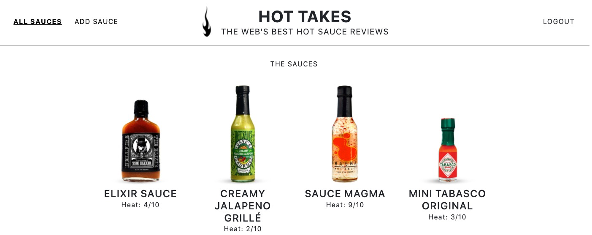

# OpenClassrooms P6 - API par cfred "Piiquante !"
***
Building a secure API for a food restaurant reviews app

# Table of Contents
1. [General Info](#general-info)
2. [Screenshot](#Screenshot)
2. [Installation](#installation)


### General Info
***
Piiquante is dedicated to the creation of spicy sauces whose recipes are kept
secret. To capitalize on its success and generate more buzz, the company
wants to create a web application where users can add
their favorite sauces and like or dislike the sauces added by others.

### Screenshot



## Installation
***
Here are the dependencies I had to install:
```
// backend folder //

$ git clone https://github.com/cfred22/piiquante-cfred
$ cd ../path/to/the/file/
$ npm install -g nodemon > (run > $ nodemon server)
$ npm install express
$ npm install mongoose
$ npm install mongoose-unique-validator
$ npm install bcrypt
$ npm install jsonwebtoken
$ npm install multer


```
***
// frontend folder //

> Create a frontend folder
> Then clone this repo https://github.com/OpenClassrooms-Student-Center/Web-Developer-P6
> npm install
> npm start
> API adress : http://localhost:8081/

Run npm start. This should both run the local server and launch your browser.
If your browser fails to launch, or shows a 404 error, navigate your browser to http://localhost:8080.
The app should reload automatically when you make a change to a file.
Use Ctrl+C in the terminal to stop the local server.

|:--------------|:-------------:|--------------:|
